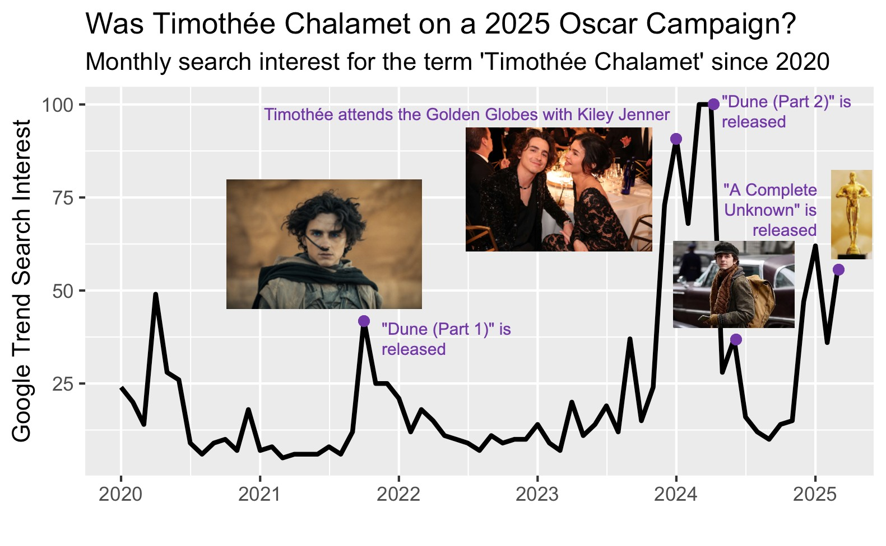

In March of 2025 the Academy updated their voting guidelines for the Annual Academy Awards. Now, voters must have watched each film nominated in a category in order to be eligible to vote for the winner. [^1] If you're wondering how that wasn't a rule already, you're not alone! [^2] 

Ever year the legitimacy of the Oscars are questioned, yet they remain one of the most important awards in the film industry. [^3] In this project, we aim to answer questions about Hollywood's most prestigious awards.

- Does the phenomenon of an "Oscar Campaign" really exist? 
- How well does Oscar buzz alone predict who is nominated for Academy Awards?

Timothee Chalamet Oscar Campaign. [^4]



```{r eval = FALSE, include = FALSE}
trends[,c("Month", "Amber Heard", "Johnny Depp")] %>%
  pivot_longer(cols = c("Amber Heard", "Johnny Depp")) %>%
  mutate(Month = ym(Month), 
         value = ifelse(value == "<1", 0, value)) %>%
  #filter(year(Month) >= 2020) %>%
  ggplot(aes(x = Month, y = as.numeric(value), group = name)) +
  geom_line(
    color = "black",
    size = 1,
  ) +
  xlab("") +
  ylab("Google Trend Search Interest") +
  labs(title = "Scandal Drives Search Interest",
       subtitle = "Monthly search interest for the terms 'Amber Heard' and 'Johnny Depp' \nsince 2004") +
  scale_x_date(date_breaks = "5 years", date_labels = "%Y") +
  facet_wrap(vars(name)) 
```

bigML predicting winners, using data from earlier in the award season. [^5]
Q scores.

More broadly, we gather a dataset of popular actors and films, as well as Academy Award nominees for future research into the career pathways of film stars. 

## Data Acquisition

We started by downloading a a dataset of Academy Award winners from Kaggle. Then we subset to Acting awards (Best Lead Actor, Best Lead Actress, Best Supporting Actor, Best Supporting Actress) and data for which Google Trends are available (since 2004). Really, this wouldn't include 2004 award winners since we have no prior trend for them. The Award eligibility is the calendar year prior to the awards, which are usually announced at a ceremony in March. The nominees are announced in January. 

Next, we used the API from The Movie Database (TMD) to extract the top three billed cast members for the 20 most commercially successful movies for each year from 2004-present. Commercially successful was determined by revenue generated. Notably, we included non-U.S. movies, which maybe we should've filtered them out but regardless. 

From these two sources, we netted a list of 668 actors. We then downloaded the monthly Google Trend Search Interest for each actor since 2004. The process of doing this via API was throttled, so we downloaded this data manually.

So we had acquired data for actors, some of whom were nominated and some of whom won, some were only commercially successful and some were both. We then cleaned the dataset and extracted some features about the actors, also from TMD, including information like gender, birth year, and nationality. We also augmented the data to include information on if they were previously nominated or previously won. 

We began with some exploratory data analysis to investigate our data and see and overt patterns or trends. We wanted to characterize a typology of actor careers, for example, we wanted to see if, based on their google trend, we could tell one-hit wonders from steadily commercially successful actors, etc. After much trial, we landed on a time series based clustering approach, but we would be interested in exploring this further.

Next, we used the trend data to predict Oscar nominations. We landed on a random forest model, and tested two models. One with features that were only based on trends, and one with additional features such as age and previous nominations and wins. We wanted to test to see if information about hype alone, how popular or in the zietgiest an actor is, would be enough to predict their nomination. This would suggest that a rule change like the one the Oscars implemented is quite necessary, since name recognition alone might persuade enough Academy members to vote for someone, especially if they don't have to be familiar with all the nominees' work. We also wanted to include the descriptive cluster solution we created earlier as a predictor in our model.

It became clear that it would be necessary to devise an appropriate sampling strategy for the random forest. By nature of this problem, predicting for nominees, and to a greater extent winners, is like searching for a needle in a haystack. Each year there are only 20 nominees, 5 in each category, so for our dataset was quite limited. To create more observations and more specific predictions, we subset the data to be the trend per year per actor, and the outcome of nomination specific to that year. We undersampled non-winners to create a balanced testing/training strategy and immediately saw model improvement.

In the future we would want to investigate putting certain constraints on the model like the fact that there can only be 5 nominations per category and there has to be a gender balance.

The data acquisition process was quite long, as there were many sources to combine and reconcile. We also gathered much more data than we ended up using, but anticipate further analysis will be fun and interesting now that the data has been gathered. 

## Research Questions

```{r setup, include=FALSE}
#library(widyr)
library(dplyr)
library(readr)
library(tidyr)
library(lubridate)
library(dtwclust)
library(ggthemes)
library(ggrepel)
library(plotly)
#library(htmlwidgets)
#library(htmltools)

# load in data
data_dir <- "./data/"
actors <- read_csv(paste0(data_dir, "actors_features.csv")) %>% distinct()
trends <- read_csv(paste0(data_dir, "trends.csv"))

# check if any data has been uploaded
uploaded_data_dir <- paste0(data_dir, "upload_data_here/")
new_files <- list.files(uploaded_data_dir)

if (length(new_files) > 0) {
  # Read all files into a list of data frames
  data_list <- lapply(new_files, function(f) {
    read_csv(file.path(uploaded_data_dir, f), skip = 1)
  })

  if (length(data_list) == 1) {
    uploaded_data <- data_list[[1]]
  } else {

    uploaded_data <- Reduce(function(x, y) left_join(x, y, by = "Month"), data_list)
  }
  
  colnames(uploaded_data) <- gsub(": \\(United States\\)", "", colnames(uploaded_data))
  uploaded_data <- head(uploaded_data, 255)

}

```

```{r eval = exists("uploaded_data"), warning = FALSE, message = FALSE, echo = FALSE}

trends <- left_join(trends, uploaded_data)
second_colname <- colnames(trends)[2]
last_colname <- tail(colnames(trends), 1)
uploaded_colnames <- colnames(uploaded_data)[-1]

trends <- trends %>%
  mutate(across(everything(), ~ ifelse(. == "<1", 0, .))) %>%
  mutate(across(c(second_colname:last_colname), ~ as.numeric(.))) %>%
  pivot_longer(cols = c(second_colname:last_colname)) %>%
  mutate(Month = ym(Month),
         uploaded = ifelse(name %in% uploaded_colnames, TRUE, FALSE))

# exploring trendlines
trends %>%
  ggplot(aes(x = Month, y = value, group = name)) +
  geom_line(
    data = filter(trends, uploaded == FALSE),
    color = "gray",
    size = 0.5,
    alpha = 0.1
  ) +
  geom_line(
    data = filter(trends, uploaded == TRUE),
    color = "purple",
    size = 1.5,
    alpha = 1
  ) +
geom_text_repel(
    data = filter(trends, uploaded == TRUE) %>%
      group_by(name) %>%
      slice_max(order_by = value, n = 1), 
    aes(label = name),
    color = "black",
    size = 3,
    box.padding = 0.5,
    max.overlaps = 10,
    direction = "both",
    nudge_y = 0.1,
    nudge_x = 0.2 
  ) +
  
  labs(
    title = "Google Trends for Actors in our Dataset"
  ) +
  theme_minimal()

```

```{r eval = exists("uploaded_data"), warning = FALSE, message = FALSE, echo = FALSE}
# Start with empty plot and manually add traces with visible = "legendonly"
p <- plot_ly(type = "scatter", mode = "lines")

trends %>%
  group_by(name) %>%
  group_split() %>%
  purrr::walk(function(df) {
    p <<- add_trace(p,
                    data = df,
                    x = ~Month,
                    y = ~value,
                    name = unique(df$name),
                    text = ~paste(name, value),
                    hoverinfo = "text",
                    visible = "legendonly")
  })

p %>%
  layout(
    title = "Google Trends for Selected Actors",
    xaxis = list(title = "Month", range = c("2004-01-01",
                                            "2025-03-01")),
    yaxis = list(title = "Relative Popularity", range = c(0, 100)),
    legend = list(title = list(text = "Actors"))
  )
```

```{r, eval = FALSE, echo = FALSE}
# summary stats and missingness
summary(actors)
# Some of the actor info of interest has NA values (15 birthdays, 5 Popularity scores), so we will have to decide what we want to do about those
summary(trends)
# <1 trend needs to be recoded as numeric, I think we should choose 0 

# Exploring birth years of nominated actors
actors %>% 
  ggplot(aes(x = Birthday)) +
  geom_histogram() +
  labs(title = "Birthday of Oscar Nominated Actors",
       subtitle = "Nominated 2004-Present")

# by winner
actors %>% 
  ggplot(aes(x = Birthday, fill = Winner)) +
  geom_histogram() +
  labs(title = "Birthday of Oscar Nominated Actors",
       subtitle = "Nominated 2004-Present")

# by gender
actors %>% 
  ggplot(aes(x = Birthday, fill = Gender)) +
  geom_histogram() +
  labs(title = "Birthday of Oscar Nominated Actors",
       subtitle = "Nominated 2004-Present")
# This is sort of interesting- there's 10 male and 10 female actors nominated every year. This suggests that men born after 1975 are less represented in nominations overall, esp. compared to women in the same age group. Dominance of older actors in male categories?

# exploring age at nomination
actors <- actors %>% 
  mutate(Year = as.Date(paste0(Year, "-01-01")),
    age_at_nomination = as.numeric(difftime(Year, Birthday, units = "days")) / 365.25) 
actors %>%
  ggplot(aes(x = age_at_nomination)) +
  geom_histogram() +
  labs(title = "Age at Nomination for Oscar Nominated Actors",
       subtitle = "Nominated 2004-Present")
# Obviously there's an error here - I'll have to go back and check the API call results for the 130 year old but I'm guessing there's another famous person with the same name

# by winner
actors %>% 
  ggplot(aes(x = age_at_nomination, fill = Winner)) +
  geom_histogram() +
  labs(title = "Age at Nomination for Oscar Nominated Actors",
       subtitle = "Nominated 2004-Present")

# by gender
actors %>% 
  ggplot(aes(x = age_at_nomination, fill = Gender)) +
  geom_histogram() +
  labs(title = "Age at Nomination for Oscar Nominated Actors",
       subtitle = "Nominated 2004-Present")

# recoding trends and making it long for viz
trends <- trends %>%
  mutate(across(everything(), ~ ifelse(. == "<1", 0, .))) %>%
  mutate(across(c("Mark Ruffalo":"Don Cheadle"), ~ as.numeric(.))) %>%
  pivot_longer(cols = c("Mark Ruffalo":"Don Cheadle")) %>%
  mutate(Month = ym(Month))

# exploring trendlines
trends %>% 
  ggplot(aes(x = Month, y = value, group = name)) +
  geom_line(alpha = .1) +
  labs(title = "Google Trendlines for all Oscar Nominated Actors",
       subtitle = "Nominated 2004-Present")

# joining 
joined <- trends %>% left_join(actors, by = c("name" = "Name"), 
                               relationship = "many-to-many")
# Not all actors joined, particularly those with punctuation in their name (like Lupita Nyong'o/Lupita Nyongo), but I can fix them
 
# by winner
joined %>%
  ggplot(aes(x = Month, y = value, group = name, color = Winner)) +
  geom_line(alpha = .1) +
  labs(title = "Google Trendlines for all Oscar Nominated Actors",
       subtitle = "Nominated 2004-Present")

# by gender
joined %>%
  ggplot(aes(x = Month, y = value, group = name, color = Gender)) +
  geom_line(alpha = .1) +
  labs(title = "Google Trendlines for all Oscar Nominated Actors",
       subtitle = "Nominated 2004-Present")

joined %>% group_by(Month) %>% summarise(value = mean(value)) %>%
  ggplot(aes(x = Month, y = value)) +
  geom_line() +
  labs(title = "Average Google Trend all Oscar Nominated Actors",
       subtitle = "Nominated 2004-Present")
# This is pretty interesting - suggests that generally Oscar nominated actors are have searched more but it has leveled off (could reflect trends in Google Search overall). The cyclical pattern is also interesting and I'm guessing it coincides with the ceremony and nomination announcements!

# Exploratory clustering for fun

# Next steps: see about picking an optimal number of clusters, get some stats about the cluster quality, and see summary stats for Actor features by cluster

# testing widyr clustering
cluster_group <-  trends %>%
  widely_kmeans(item = name, 
                feature = Month, 
                value = value,
                k = 3)

actor_with_cluster <- left_join(trends, cluster_group)

actor_with_cluster %>%
  ggplot(aes(x = Month, y = value, group = name, colour = cluster)) +
  geom_line(show.legend = F, alpha = .25) +
  scale_y_continuous(labels = scales::comma) +
  facet_wrap(vars(cluster)) +
  scale_color_solarized()

# testing dtwclust clustering - I think this is my preference for more options for type of clustering and distance metrics
wide <- trends %>%
  pivot_wider(names_from = Month, values_from = value) %>%
  column_to_rownames("name")

matrix <- as.matrix(wide)

# I tested out a few options, but I need to print out some organized summaries
clusters <- tsclust(matrix, 
                       k = 6L,  
                       distance = "SBD",
                       type = "tadpole",
                       seed = 3247,
                       trace = TRUE, 
                       control = tadpole_control(dc = 100,
                                                 window.size = 18L))  
cluster_assignments <- clusters@cluster
cluster_group <- data.frame(
  name = rownames(matrix), 
  cluster = cluster_assignments
)

actor_with_cluster <- left_join(trends, cluster_group, by = "name")

actor_with_cluster %>%
  ggplot(aes(x = Month, y = value, group = name, colour = factor(cluster))) +
  geom_line(show.legend = FALSE, alpha = 0.25) +
  scale_y_continuous(labels = scales::comma) +
  facet_wrap(vars(cluster)) +  # Separate plots for each cluster
  scale_color_solarized() +
  theme_minimal() +
  labs(title = "Time Series Clustering", colour = "Cluster")

table(actor_with_cluster$cluster)

# Dendrograms for hierarchical clustering
plot(clusters, main = "Dendrogram of Hierarchical Clustering", xlab = "Time Series", ylab = "Distance")
plot(clusters, 
     main = "Dendrogram of Hierarchical Clustering", 
     xlab = "Time Series", 
     ylab = "Distance",
     labels = FALSE,
     cex = 0.25) 


missing <- joined %>% distinct(name, type) %>% filter(is.na(type)) %>% pull(name)


```


[^1]: "Awards rules and campaign promotional regulations approved for 98th Oscars." Academy Press Office. Accessed: May 4, 2025. [Online.] Available: https://press.oscars.org/news/awards-rules-and-campaign-promotional-regulations-approved-98th-oscarsr
[^2]: Taylor, Derrick Bryson. "A New Requirement for Oscar Voters: They Must Actually Watch the Films." The New York Times. Accessed: May 4, 2025. [Online.] Available: https://www.nytimes.com/2025/04/24/movies/oscars-voting-rules.html
[^3]: Barber, Nicholas. "Oscars 2025: Why people claim Kieran Culkin, Zoe Saldaña and Ariana Grande's nominations are 'category fraud.'" BBC. Accessed: May 4, 2025. [Online.] Available: https://www.bbc.com/culture/article/20250214-oscars-2025-why-people-claim-kieran-culkin-zoe-saldaa-and-ariana-grandes-nominations-are-category-fraud ; Earl, William. "Oscars Snubs and Surprises: Mikey Madison Scores, ‘I’m Still Here’ Shocks and Diane Warren Has 16th Straight Loss." Variety. Accessed: May 4, 2025. [Online.] Available: https://variety.com/2025/awards/news/2025-oscars-snubs-surprises-1236319091/
[^4]: Hyden, Steven. "Timothée Chalamet Should Win an Oscar for His Oscar Campaign." The New York Times. Accessed: May 4, 2025. [Online.] Available: https://www.nytimes.com/2025/02/26/magazine/timothee-chalamet-oscar-campaign.html
[^5]: atakancetinsoy. "Predicting the 2025 Oscar Winners with Machine Learning." bigML. Accessed: May 4, 2025. [Online.] Available: https://blog.bigml.com/2025/02/28/predicting-the-2025-oscar-winners-with-machine-learning/ ; Movies (Oscars 2001-2025). bigML. Accessed: May 4, 2025. [Online.] Available: https://bigml.com/user/academy_awards/gallery/dataset/67bc509a54e70fb808f13df3